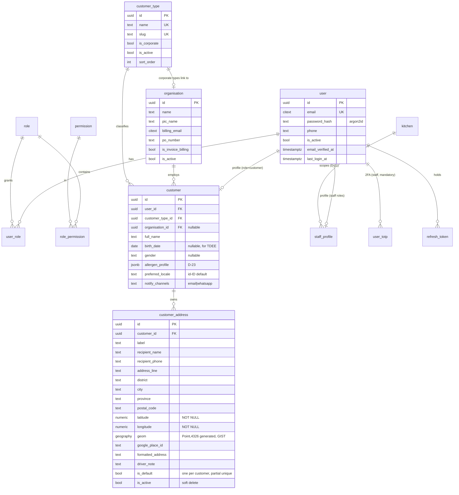
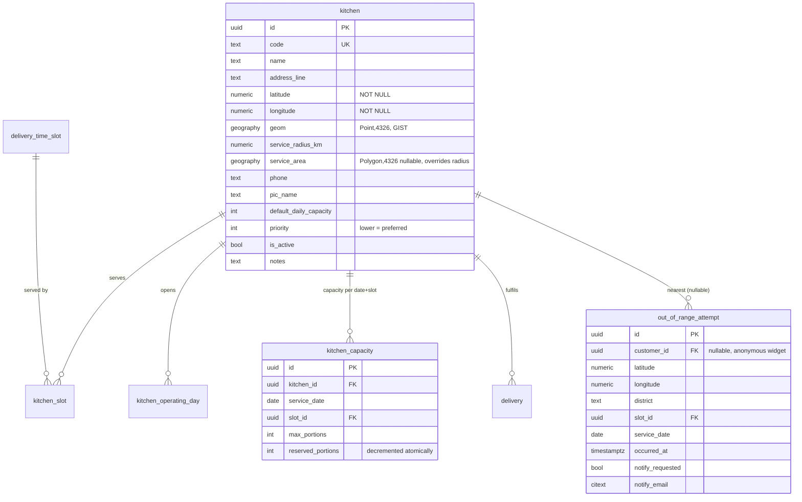
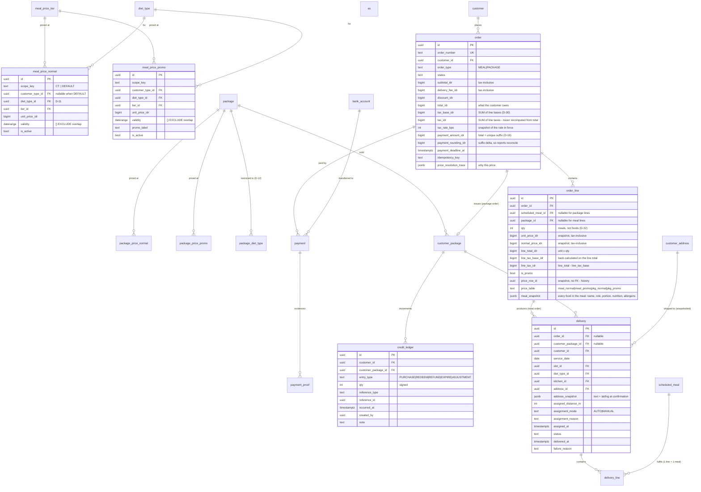
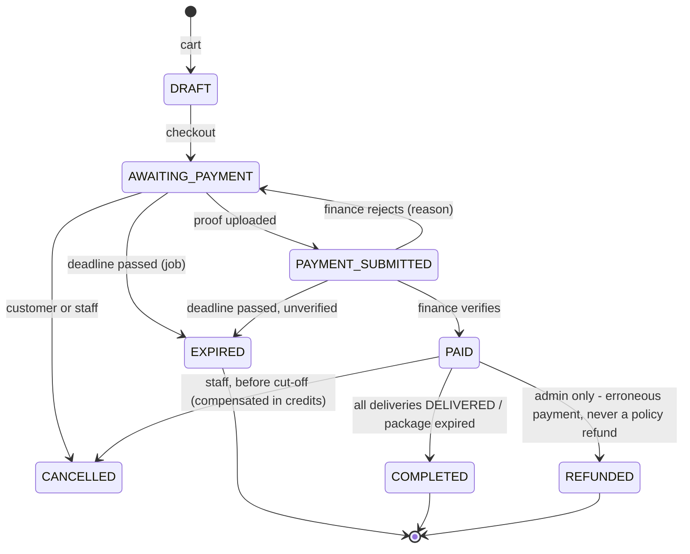
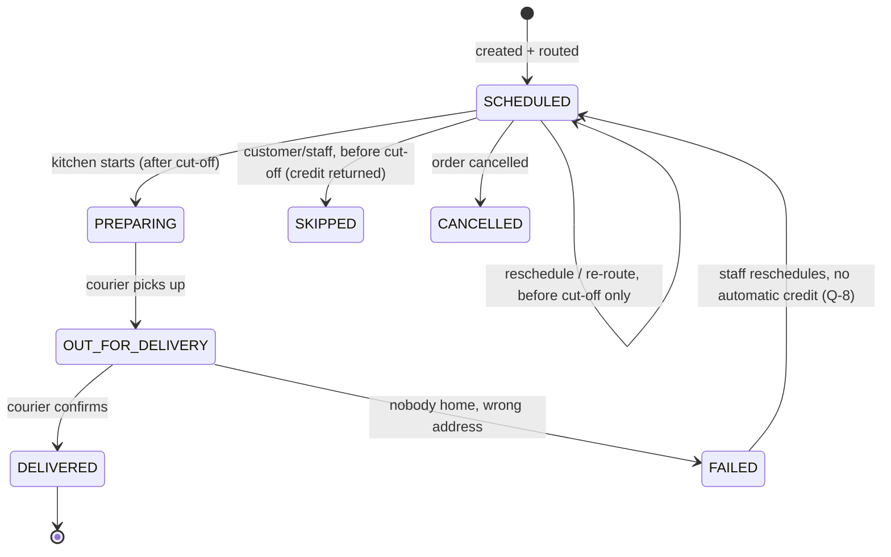
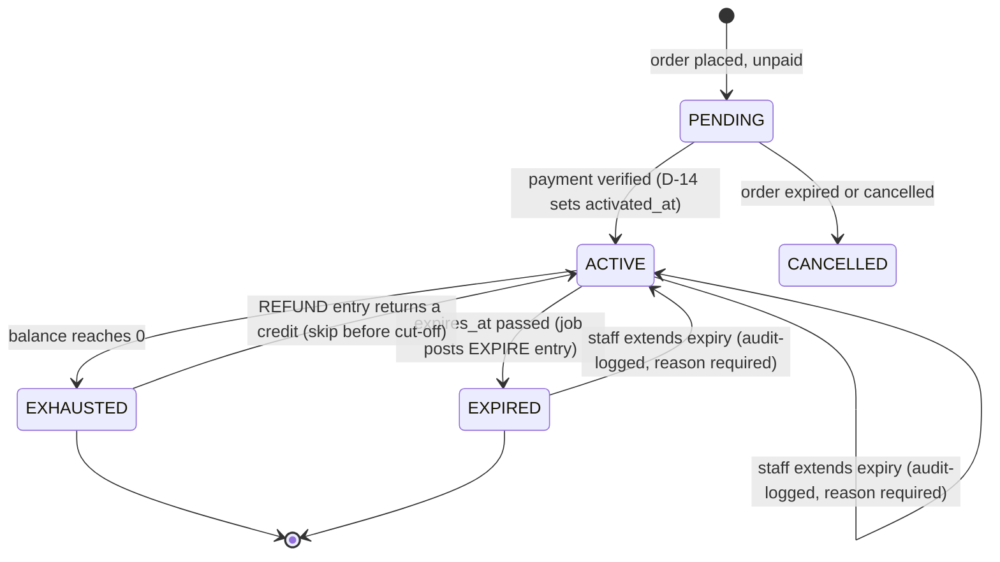
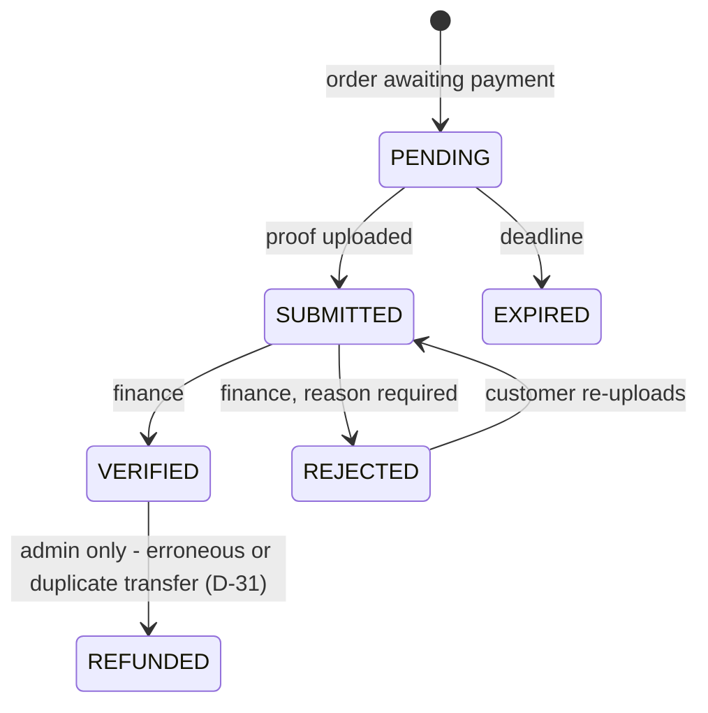

# 01 — Domain model

**Project:** Evermore — B2C healthy catering, Jakarta (`www.evermore.co.id`)
**Version:** 0.1 — planning. **Not approved. No code is built from this yet.**
**Date:** 2026-08-12
**Source:** Steven's master prompt (`docs/PROMPT.md` content, 2026-08-12).

This document is the entity model, the relationships, the state machines and the
ERD. Where the brief left a choice open it is marked **[D-n]** and resolved in
`02-decisions.md`; where the brief is silent or self-contradictory the gap is
raised in `03-open-questions.md` as **[Q-n]**. Nothing here invents a rule that
neither document states.

Conventions from `CLAUDE.md`, applied without restating them per table:

- Primary keys are **UUIDv7**. Human-facing codes (order number, kitchen code)
  are CSPRNG + Crockford base32 or a dated sequence, never the primary key.
- Money is **`BIGINT` whole rupiah**. IDR's minor unit (sen) is obsolete and not
  used in retail; `Rp 500.000` is stored as `500000`. No floating point on any
  path that touches money. Percentages are basis points.
- Timestamps are **`timestamptz`, UTC**. A *calendar* date that belongs to the
  business (delivery date, price validity, menu date) is a **`DATE`**, not an
  instant — a delivery on 2026-09-01 is that date in `Asia/Jakarta` regardless of
  the server. Any comparison of "now" against a business date converts through
  `Asia/Jakarta` explicitly.
- Every table carries `created_at`, `updated_at`; every table a human edits
  carries `created_by`, `updated_by`.
- Configurable values are rows in **`sys_parameters`**, not constants. The brief
  says "system settings"; that is this table.

---

## 1. Bounded areas

| # | Area | Owns |
|---|---|---|
| A | Identity & access | users, roles, permissions, 2FA, sessions, audit |
| B | Customer | customers, customer types, organisations, addresses |
| C | Catalogue | diet types, foods, nutrition, allergens, ingredients |
| D | Schedule | delivery time slots, food schedule (menu calendar) |
| E | Kitchen & geography | kitchens, service areas, capacity, routing |
| F | Pricing | tiers, four price tables, resolution, snapshots |
| G | Ordering | carts, orders, order lines, payments |
| H | Packages & credits | packages, customer packages, credit ledger |
| I | Fulfilment | deliveries, manifests, production sheets |
| J | Platform | sys_parameters, notifications, jobs, idempotency |

Layering follows `CLAUDE.md` §2 — the pricing resolver, the credit ledger rules
and the kitchen router are **pure domain code with no I/O**, which is what makes
the near-100% coverage the brief asks for (§14) achievable.

---

## 2. ERD

Split into four diagrams because one is unreadable. Foreign keys are shown; the
`platform` tables (`sys_parameters`, `audit_log`, `notification_log`,
`idempotency_key`, `job`) reference nothing and are omitted from the diagrams.

### 2.1 Identity, customer, address



### 2.2 Catalogue and schedule

```mermaid
erDiagram
    diet_type ||--o{ diet_subtype : "has (Special Diet only)"
    diet_type ||--o{ food_diet_type : allows
    food ||--o{ food_diet_type : "belongs to"
    food ||--|| food_nutrition : "has one per portion"
    food ||--o{ food_photo : has
    food ||--o{ food_allergen : declares
    allergen ||--o{ food_allergen : in
    food ||--o{ food_ingredient : "composed of (D-6, later)"
    ingredient ||--o{ food_ingredient : "used in (D-6, later)"
    scheduled_meal ||--o{ scheduled_meal_item : "composed of"
    food ||--o{ scheduled_meal_item : scheduled
    diet_type ||--o{ scheduled_meal : for
    delivery_time_slot ||--o{ scheduled_meal : "meal slot"

    diet_type {
        uuid id PK
        text name
        text slug UK
        text description
        text hero_image_key
        int  sort_order
        bool has_subtypes
        bool is_active
    }
    diet_subtype {
        uuid id PK
        uuid diet_type_id FK
        text name
        text slug
        bool is_active
    }
    food {
        uuid id PK
        text name
        text slug UK
        text description
        text portion_size
        bool is_active
    }
    food_nutrition {
        uuid id PK
        uuid food_id FK UK
        int calories_kcal
        int protein_mg
        int fat_mg
        int saturated_fat_mg
        int carbohydrate_mg
        int sugar_mg
        int fibre_mg
        int sodium_mg
        int cholesterol_mg
        jsonb extras
    }
    delivery_time_slot {
        uuid id PK
        time  slot_time "15-min grid"
        text  alias "customer-facing"
        int   sort_order
        bool  is_active
    }
    scheduled_meal {
        uuid id PK
        date  service_date
        uuid  diet_type_id FK
        uuid  slot_id FK
        int   qty_capacity "nullable - meals, not foods"
        text  status "DRAFT|PUBLISHED"
        timestamptz published_at
    }
    scheduled_meal_item {
        uuid id PK
        uuid scheduled_meal_id FK
        uuid food_id FK
        text item_role "MAIN|SIDE|DESSERT|DRINK (D-7)"
        int  sort_order
    }
```

### 2.3 Kitchens, geography, capacity



### 2.4 Pricing, ordering, credits, fulfilment



---

## 3. Entities in detail — the parts the diagram cannot carry

### 3.1 Customer types and organisations (§4.1)

Table-driven, never an enum. Seeded: `Customer Default`, `Siloam Customer`,
`Company A`, `Company B`. `Customer Default` carries `is_system = true` so it
cannot be deleted — every registration lands on it and a missing default breaks
signup.

`is_corporate` on the type drives the UI (a corporate customer must be attached
to an `organisation`), but the **link is on the customer**, not the type — two
companies can share a type and one company can have staff on different types.
Changing a customer's type is staff-only, audit-logged, and — critically —
**does not reprice existing orders**, because prices are snapshotted (§5.6).

### 3.2 Diet types (§4.2)

`diet_type` → `diet_subtype` is nullable and only `Special Diet` seeds subtypes
(`Diabetic`, `Cholesterol`). The schedule, pricing and ordering all key on
`diet_type_id`; the subtype is descriptive metadata on the customer and on the
food, never a pricing or scheduling axis. That keeps the price matrix from
multiplying by subtype. **[Q-6]** confirms this is intended.

### 3.3 Food and nutrition (§4.3)

**Nutrition lives on the food**, one row per food per portion, stored as
**integers in milligrams** (calories in whole kcal), not decimals. That is not
only the money rule applied to nutrition — it is what makes **D-33** work: a
meal's panel is the *sum* of its foods' panels, and summing integers is exact
where summing decimals drifts by a few mg per dish and visibly per week on the
intake chart (§13.8). Display divides by 1000 at the edge. `extras JSONB` takes
anything the label needs that is not a column; extras are summed by key when the
key is numeric and dropped from the aggregate otherwise.

`ingredient` + `food_ingredient` (per-100g nutrition, auto-computing the panel)
is modelled but **not built in phase 1** — see **[D-6]**.

### 3.4 The menu calendar — foods compose meals, and the meal is what is sold

Confirmed by Steven, 2026-08-12 (**D-32**, **D-33**):

```
food  ──┐
food  ──┼──►  meal  ◄── the customer picks this, and 1 credit buys one
food  ──┘     (a date + diet type + slot)
```

- **`scheduled_meal`** — one row per (`service_date`, `diet_type_id`, `slot_id`).
  This is the unit of sale, the unit of capacity, and the thing that is
  published. Unique on those three columns.
- **`scheduled_meal_item`** — the foods in it, each with `item_role`
  (`MAIN`, `SIDE`, `DESSERT`, `DRINK`) and a sort order. Unique on
  (`scheduled_meal_id`, `food_id`), which preserves the brief's rule that a dish
  cannot be scheduled twice in one sitting.

This replaces the flat `food_schedule` table the brief sketched. The reason is
Steven's rule that **one credit buys one meal even when that meal contains a
single food**: if the schedule row is the *food*, then capacity, publication and
redemption all attach to the wrong thing, and a meal's price would depend on how
many components staff happened to schedule. Making the meal an entity puts
`qty_capacity`, `status`/`published_at` and the credit boundary in one place.

**Nutrition is aggregated, never typed at the meal level** — the panel a customer
sees for a meal is `SUM` over its items' `food_nutrition`, computed in pure
domain code and **snapshotted onto the order line at purchase** so a later recipe
edit cannot rewrite what someone was told they ate.

A meal carries an optional display `name` and `hero_photo_key`; when blank they
fall back to the `MAIN` item's name and first photo, so staff scheduling a week
do not have to name thirty-five meals.

`status` is `DRAFT` until published; **customers only ever query `PUBLISHED`**,
enforced in the repository, not the handler. The calendar is **global across
kitchens** — **[D-8]**. `kitchen_id` is deliberately absent; adding it later is
an additive migration.

### 3.5 Pricing (§5)

Four tables, four admin forms, as required. All four share the same shape:

- `scope_key TEXT NOT NULL` — either `'DEFAULT'` or `'CT:<customer_type_uuid>'`.
  A generated column derived from `customer_type_id` so it cannot drift, and the
  thing the exclusion constraint keys on (a nullable `customer_type_id` cannot be
  compared with `=` in an exclusion constraint — `NULL` is not equal to `NULL`,
  so two `DEFAULT` rows would both be accepted. That is the reason the brief's
  `scope_key` exists, and it is load-bearing).
- `validity daterange` with `[)` bounds; open-ended is `[valid_from,)`.
- `EXCLUDE USING gist (...)` per §5.3, requiring `btree_gist`.

**Resolution order** (pure function, exhaustively unit-tested):

1. Resolve **scope**: a row whose `scope_key = 'CT:<customer's type>'` and whose
   `validity` contains the *order date*. If none, `scope_key = 'DEFAULT'`.
2. Within the resolved scope, resolve **promo over normal** — **[D-9]**.
3. No row in either scope → **block**, `PRICE_NOT_CONFIGURED`, never guess.

Every resolution writes a `price_resolution_trace` onto the order (which scope
matched, which table, which row id, which tier) so "why did this customer pay
that?" is answerable from the record without re-running the resolver.

**Tiers** (`meal_price_tier`): `min_qty`, `max_qty` nullable = ∞, **counted in
meals** (D-32), not foods. Validated on save to have no overlaps and no gaps from
1 up to the max order quantity from `sys_parameters` (999). Semantics are
**flat** — **[D-10]**.

**Every price in all four tables is tax-inclusive** — the number staff type is
the number the customer pays. The split is computed and stored at order time,
never on the price row. See §3.11.

### 3.11 Tax (D-30)

Steven, 2026-08-12: *"all price is included price, however in database split
base price and tax; tax percentage can be changed via backend."*

- `tax_rate_bps` is a **`sys_parameters` row** (11% = `1100`), editable in the
  back office, audit-logged like any other parameter.
- The four price tables hold **only the inclusive price**. The split is *not*
  stored there, deliberately: a rate change from 11% to 12% would otherwise have
  to rewrite every price row in every table, and historical rows would end up
  carrying a rate they were never sold under. Instead the rate is snapshotted per
  order.
- The split is computed **on the line total, not the unit price** — computing per
  unit and multiplying multiplies the rounding error by the quantity.

Back-calculation, integer-only and half-up, in the same style as the basis-point
rule in `CLAUDE.md` §4, with `D = 10000 + tax_rate_bps`:

```
base = (line_total * 10000 + D/2) / D      -- integer division
tax  = line_total - base                    -- the residue, never recomputed
```

Worked: Rp 500.000 inclusive at 1100 bps → `base = 450.450`, `tax = 49.550`, and
`450450 + 49550 = 500000` exactly. Taking the tax as the residue rather than
computing it separately is what guarantees base + tax always equals the price.

- **Order-level `tax_idr` is the `SUM` of the line taxes**, never re-derived from
  the order total — re-deriving reintroduces a rounding difference between the
  invoice and its own lines.
- **The delivery fee is a taxable supply too** and is split the same way at the
  same rate.
- The **payment suffix (D-16) is not taxable** — it is a matching device, not
  consideration. It lands in `payment_rounding_idr` and is excluded from the tax
  base, which is the second reason that column exists.

**Still needed before the pricing engine ships** (`03-open-questions.md` Q-1a):
the PPN **rate** to seed, whether Evermore is **PKP-registered**, and the NPWP
and legal entity name that a corporate invoice must show.

### 3.6 Packages and credits (§5.5, §7)

`customer_package` is the purchased instance: `package_id`, `meal_credits`
(snapshot), `validity_days` (snapshot), `activated_at`, `expires_at` (a **DATE**
in `Asia/Jakarta`), `status`.

Balance is **never stored**. `remaining = SUM(credit_ledger.qty)` for the
package, and every movement is an append-only row. The table has no `UPDATE` or
`DELETE` path at all — that is stated in its migration, per `CLAUDE.md` §4.

Redemption is a transaction that takes `SELECT ... FOR UPDATE` on the
`customer_package` row, recomputes the balance inside the lock, and refuses at
zero. A `CHECK` cannot express `SUM(...) >= 0` across rows, so the lock is the
invariant's enforcement point and it ships with the concurrency test the house
rules demand.

**One credit buys one meal** (D-32), whatever that meal contains — a single dish
and a four-component set both cost one credit. So a `REDEEM` entry is `−1` per
meal, and a customer taking two portions of the same meal spends two credits.
The credit is *never* per food; nothing in the ledger counts foods.

**Credits are never money** (D-31). A `REFUND` ledger entry returns a *credit*
— it is not a payment. No path in this system moves rupiah back to a customer
except the erroneous-payment case in §4.4.

### 3.7 Orders, deliveries and the two flows (§6)

An **order** is the commercial event. A **delivery** is the fulfilment event.
They are separate because one package order produces N deliveries over weeks, to
different addresses, through different kitchens.

- **Flow A (meals):** the customer picks a **meal** from the published calendar —
  a date + slot + diet type — with a quantity, an address and a delivery slot.
  One `order_line` per (meal, address); deliveries are created at checkout, one
  per (date, slot, address) combination in the cart. The customer never picks
  individual foods; the meal's composition is whatever staff scheduled, and it is
  snapshotted onto the line.
- **Flow B (packages):** order → payment verified → `customer_package` +
  `PURCHASE` ledger entry → customer picks meals later; **each meal taken is one
  `REDEEM` entry (`−1`) and one `delivery_line`**, grouped into a `delivery` per
  (date, slot, address).

`delivery_line` is therefore **one meal**, carrying its own `meal_snapshot` — the
foods, their roles and their nutrition as at confirmation. That snapshot is what
the packing label and the kitchen production sheet print from, so a menu
substitution made after the fact cannot silently change what was cooked.

Kitchen routing runs **per delivery** at the moment the delivery is created —
for packages that is slot-pick time, not purchase time. Kitchen capacity is
therefore consumed at slot-pick time too. **[Q-9]** raises what this means for a
customer who buys 20 credits and finds their kitchen full.

### 3.8 Addresses and delivery (§8)

`latitude`/`longitude` are `NOT NULL`. `geom` is a **generated** column
(`ST_SetSRID(ST_MakePoint(longitude, latitude), 4326)::geography`) so it cannot
disagree with the numbers, GIST-indexed. Server-side bounds validation rejects
anything outside a Jabodetabek envelope **[Q-11]** as well as the obvious
`(0,0)`.

`is_default` is enforced by a **partial unique index**
(`WHERE is_default AND is_active`), not application logic.

Address text **and coordinates are snapshotted onto the delivery** at
confirmation. Editing a saved address never rewrites history.

### 3.9 Payments (§10)

`payment` holds `expected_amount_idr` (order total) and
`payment_amount_idr` (total plus the unique suffix, **[D-16]**). These are
separate columns because the suffix means **the amount transferred is not the
sum of the lines**, and a report that adds line totals will disagree with the
bank statement by up to Rp 999 per order unless the difference has a home. The
suffix difference is posted as `payment_rounding_idr` on the order so the sales
report reconciles exactly.

`bank_account` is a table, not a setting blob — multiple accounts, each with
`is_active` and `sort_order`.

### 3.10 Platform tables

`sys_parameters` (key, value, type, group, description, `is_secret`,
`updated_by`) with full admin CRUD and search, per `CLAUDE.md` §7. Seeded with
every tunable this brief names: cut-off time and lead days, payment deadline,
max qty per line, delivery fee bands, free-delivery threshold, low-credit
threshold, expiry-warning days, bank accounts' display copy, WhatsApp CS number,
Google Maps daily quota alarm thresholds.

`audit_log` (actor, action, entity_type, entity_id, before JSONB, after JSONB,
ip, user_agent, occurred_at) — append-only, written for every staff action
touching money, prices, customer type, credits, package expiry, kitchen
assignment and service areas.

`notification_log`, `idempotency_key`, `job` complete the set.

---

## 4. State machines

### 4.1 Order — commercial lifecycle

The brief's §6.3 list mixes commercial states with fulfilment states.
`SCHEDULED → PREPARING → OUT_FOR_DELIVERY → DELIVERED` describes a *delivery*,
and an order with 20 deliveries cannot be in one of them. Recommendation
**[D-15]**: the order owns the commercial states, the delivery owns fulfilment,
and the brief's fulfilment names remain available on the API as a **derived**
read-only `fulfilment_status` so nothing in §6.3 is lost.



Illegal transitions are rejected by the domain layer, not the handler, and the
transition table is a unit test.

**No refunds (D-31).** Steven's rule: money does not go back. Two consequences
worth stating rather than discovering:

1. A staff-cancelled `PAID` order is compensated in **credits**, via an
   `ADJUSTMENT` ledger entry with a reason — not in rupiah. Same for a delivery
   the kitchen could not fulfil.
2. `REFUNDED` survives on the machine anyway, reachable **only by an admin**, for
   the case manual bank transfer guarantees will happen: a customer transfers
   twice, or transfers the wrong amount. That is returning money that was never
   owed, not honouring a refund policy, and refusing to model it would leave
   finance moving money with no record of it. It requires a reason, writes an
   audit row, and is reported separately from sales.

### 4.2 Delivery — fulfilment lifecycle



### 4.3 Customer package



Reactivating an `EXPIRED` package by extending the expiry must **reverse the
`EXPIRE` ledger entry with a compensating `ADJUSTMENT`**, never delete it — the
ledger is append-only and the balance history has to reconcile.

### 4.4 Payment



---

## 5. The three algorithms that get near-100% coverage

### 5.1 Price resolver — pure

```
resolve(customer_type, diet_type, tier_qty, order_date) -> ResolvedPrice | error
```

Test matrix: scope hit · scope miss falling back to DEFAULT · both missing
(blocks) · promo overriding normal in the same scope · **customer-type normal
beating a DEFAULT promo (D-9)** · tier boundary at min · at max · at max+1 · open
-ended `max_qty` · validity boundary on `valid_from` · on `valid_to` (exclusive)
· overlapping rows rejected by the constraint · qty above the configured max.

**Tax split (D-30), tested with the resolver because it is the same money path:**
base + tax always equals the inclusive price, at 0 bps · at 1100 · at 1200 ·
on a line total of Rp 1 · on 999 × the maximum price without overflowing `int64`
· order tax equals the sum of line taxes and is never re-derived from the total
· the payment suffix is excluded from the tax base · a rate change does not move
an already-placed order.

### 5.2 Credit ledger — pure rules + one locked transaction

Test matrix: purchase posts +N · redeem posts −1 · balance never below zero ·
two concurrent redemptions of the last credit, one wins (the concurrency test) ·
skip before cut-off returns a credit · skip after cut-off does not · **one credit
per meal regardless of how many foods it contains (D-32)** · expiry posts the
negative remainder and the remainder is forfeited, never refunded in money
(D-31) · a delivery may not be scheduled after `expires_at` (D-27) · expiry racing a redemption · staff extension reverses an
expiry with a compensating entry · adjustment requires a reason.

### 5.2b Meal nutrition aggregation — pure (D-33)

```
aggregate(meal_items[]) -> NutritionPanel
```

Test matrix: one food · four foods · a food with a missing panel (the meal's
panel is marked incomplete rather than under-reporting) · integer sums exact at
every field · numeric `extras` keys summed by key, non-numeric dropped · the
snapshot on an order line does not change when a food's recipe is later edited.

### 5.3 Kitchen router — pure, given candidates

```
route(address_point, slot, date, kitchens[], capacity[]) -> Assignment | NotServiceable
```

Test matrix, exactly as the brief lists it: inside one radius · inside two
overlapping radii (priority decides, then distance) · inside a polygon but
outside that kitchen's radius (polygon wins) · inside a radius but outside the
polygon (polygon wins, not serviceable from that kitchen) · outside everything
(blocks, logs the attempt) · candidate at capacity is dropped · inactive kitchen
dropped · kitchen not serving that slot dropped · kitchen closed that weekday
dropped · **manual assignment is never overwritten by a re-route** · re-route
after cut-off refused.

---

## 6. What this model deliberately does not do yet

- No `kitchen_id` on `scheduled_meal` (**[D-8]**, global menu).
- No `ingredient` build (**[D-6]**), though the tables are designed.
- No voucher/referral tables — §13.5 says they live in a **discount layer applied
  after price resolution**, so they never touch the four price tables. Modelled
  in `04-milestones.md` as a later slice.
- No per-employee corporate credit allocation UI, but `organisation` and the
  ledger's `customer_package` ownership are shaped so it is additive (§13.6).
- No QRIS. `PaymentProvider` is an interface from day one with
  `ManualTransferProvider` as the only implementation (§10).
